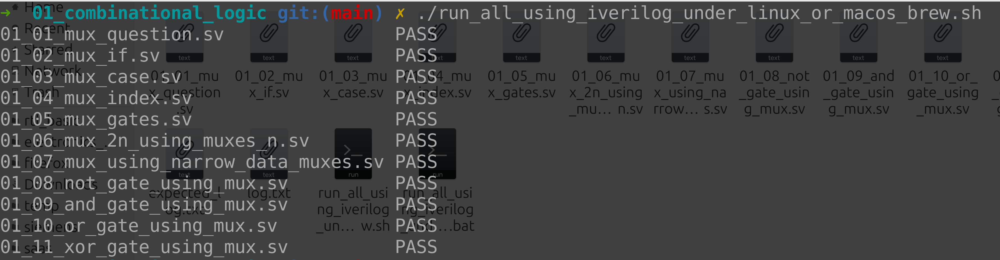
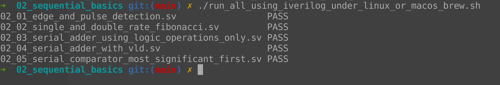
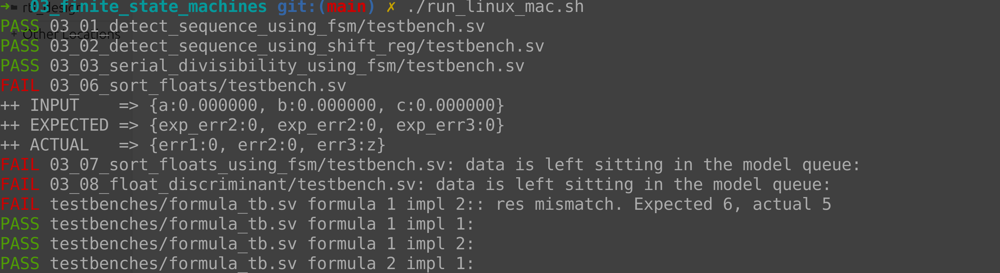
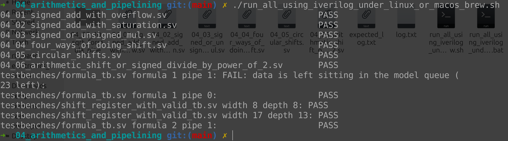
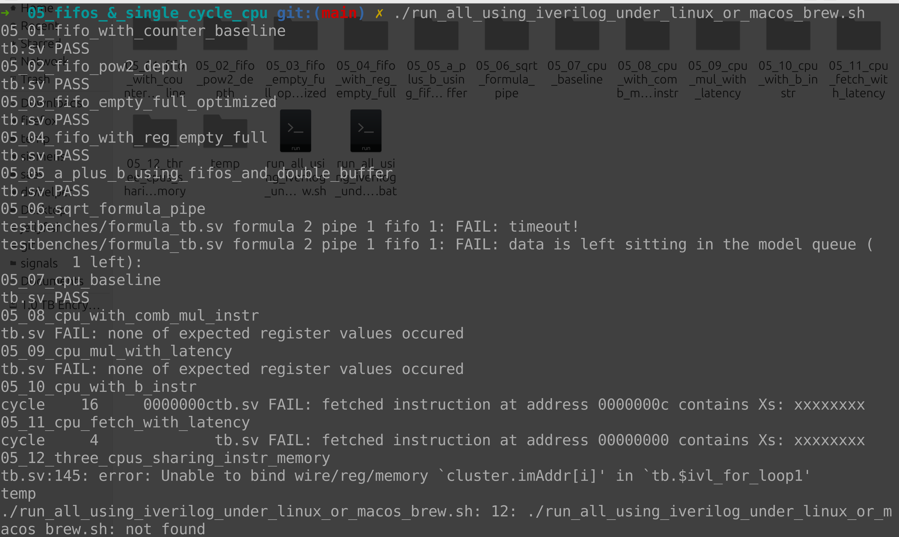

# Philip Sisa M. works

Forked from [https://github.com/yuri-panchul/systemverilog-homework](https://github.com/yuri-panchul/systemverilog-homework)

## Combinational logic

## Sequencial logic

## Finite State Machines

## Arithmetic & Pipelining

## Fifos & CPU 

